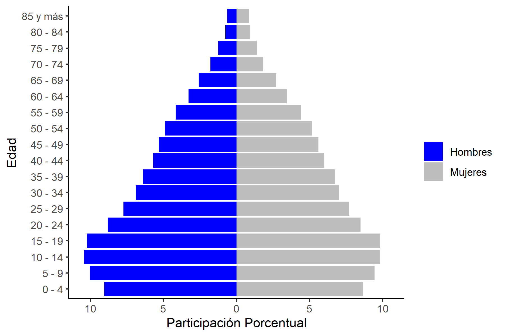

# Introducción.
\pagebreak
# Objetivo.

Analizar las capacidades competitivas de las Unidades de Producción Agropecuaria (UPAs) del Departamento del Magdalena. Como fuente de datos se planea usar el Censo Nacional Agropecuario (CNA) del 2014, además, se pueden usar datos de la Gran Encuesta de Hogares Integrados y el Censo Nacional; todos construidos por el DANE.

Es posible construir un modelo econométrico de corte transversal: $y= b0 + b1x1 + b2x2 + ...$ 

Variables como la extensión de tierras, número de maquinas, años de estudios; al igual que factores sociales como la pobreza monetaria, índice Gini de tierras, entre otros, pueden ayudar a llevar a la contrucción de dicho modelo.


De no ser posible contruir el modelo, se optará por hacer un análisis descriptivo de las UPAs magdalenenses, haciendo una comparación entre departamentos: explicando de manera expositiva las posibles causas y su relación con el contexto del Magdalena. 


\pagebreak
# Generalidades del Departamento.

El departamento del Magdalena se localiza al norte del país. Posee una extensión de 23.188 km^2, representado el 2,03 % del territorio nacional y el 11.05 % de la Región Caribe. Limita con el Mar Caribe y los departamentos del Atlántico, Bolívar, Cesar y Guajira. Su distribución político-administrativa la conforman 29 municipios y su capital, Santa Marta.

Según el Censo Nacional de Población y Vivienda del 2018, el Departamento del Magdalena posee una población de 1.263.788, donde el 50,05 % son hombres y el 49,95 % mujeres. Además, el 71 % de los magdalenenses se ubican en las cabeceras municipales[^1]; el 20 % en los centros poblados[^2]  y 8,8 % en las zonas rurales dispersas[^3]; es decir, el 29 %  de los habitantes se define como la población rural de los municipios[^4].

La población magdalenense es en su mayoría joven: el 47,3 % de esta se encuentra entre los 5 y 24 años (véase Figura 1). Asimismo, en la población rural se encuentran más hombres que mujeres: 52,72 % y 47,28 % respectivamente; siendo  el 51,5 % personas que se encuentran entre los 5 y 24 años.

```{r Pirámide, echo= F, eval=F, comment= NA}
require(pacman)
p_load(rio,skimr,janitor,dplyr, tidyverse) 
pirámide<-import(file="Input/Datos generales/Pirámide.xlsx", sheet="Magdalena", skip=2)%>% clean_names()

pirámide<- pirámide %>% mutate(Hombres=hombre/sum(hombre)*100, Mujeres=mujer/sum(mujer)*100)

P <- pirámide%>% select(edad, Hombres, Mujeres)

lab_edad<-c(paste(seq(0,80,5), seq(4,84,5), sep=" - "), "85 y más" )

P$edad<-factor(P$edad,labels=lab_edad)

DP<-P%>% gather(sexo,p_edad,-1)

 gp<- ggplot(DP, aes(x=edad,fill=sexo,
              y=ifelse(sexo=="Hombres",-p_edad,p_edad)))+
   geom_bar(stat = "identity")+
  scale_y_continuous(limits = max(DP$p_edad)*c(-1,1), labels=abs)+
   labs(x="Edad", y="Participación Porcentual") + 
   scale_fill_manual(values = c("blue", "grey"),name ="")+
   coord_flip()+
   scale_color_grey()+
   theme_classic()

ggsave(plot = gp, filename = "Output/Pirámide.png", width=6, height =4)

```
<!--Averiguar cómo poner figura 1 en negrita, nombre encima de la gráfica--> 

<!--Averiguar cómo subir resolución a la imagen--> 

<!--Averiguar cómo poner fuente:: *elaboración propia usando datos del DANE – Censo Nacional de Población y Vivienda (CNPV) 2018* --> 

<!--Averiguar cómo poner de menor tamaño las notas de pie--> 

<!--Averiguar cómo hacer que las notas de pie se queden al final de la hoja-->

<!--Averiguar cómo hacer citas y la bibliografia--> 

<!--Averiguar cómo hacer la tabla de contenido y la lista de gráficas y tablas, etc.--> 

<!--Averiguar cómo cambiar los colores de la pirámide, y que la ejecute normal, sin necesidad de exportarla como imagen.--> 


{withd=40%} 

[^1]: El DANE define a las Cabeceras como “(…) el área geográfica que está definida por un perímetro urbano, cuyos límites se establecen por acuerdos del Concejo Municipal. Corresponde al lugar en donde se ubica la sede administrativa de un municipio (…)”
[^2]: El DANE define al Centro Poblado como “(…) una concentración de mínimo veinte (20) viviendas contiguas, vecinas o adosadas entre sí, ubicada en el área rural de un municipio o de un Corregimiento Departamental. (…)”.
[^3]: El DANE define a las Zonas Rurales Dispersas como “(…) la disposición dispersa de viviendas y explotaciones agropecuarias existentes en ella. No cuenta con un trazado o nomenclatura de calles, carreteras, avenidas, y demás. Tampoco dispone, por lo general, de servicios públicos y otro tipo de facilidades propias de las áreas urbanas (…)”.
[^4]: Para efectos prácticos el DANE contabiliza a los Centros Poblados y Área Rural Dispersa como Población Rural de los Municipios.

El departamento del Magdalena ha presentado tasas de ocupación y desempleo similares a los niveles nacionales:

 * La _**tasa ocupación**_ ha oscilado entre el 51 y 54 % desde el 2007 al 2021, siendo del 53,2 % en este último año. 
 
 * La _**tasa de desempleo**_ no ha presentado variaciones significativas entre estos años, pasó del 11,5 % en el 2007 al 11 % en el 2021. 

<!--Pon un excel con la ocupación y desempleo.--> 

```{r tasas ocupación y desempleo, echo=FALSE, eval=F, comment=NA}
require(pacman)
p_load(rio,skimr,janitor,dplyr, tidyverse) 

oyd<-import(file="Datos generales/Pirámide.xlsx", sheet="TasasOyD", skip=2)%>% clean_names()


# agregar gráfico de comportamiento

```


Según la Gran Encuesta Integrada de Hogares (GEIH) del 2021, dentro de las actividades económicas que en promedio generaron más ocupación en el departamento para el 2021 fueron: el comercio y reparación de vehículos (21 %), el sector agrícola (20 %) y el alojamiento y servicios de comida (10 %).

```{r actividades de ocupación, echo=FALSE, eval=F, comment=NA}
require(pacman)
p_load(rio,skimr,janitor,dplyr, tidyverse,knitr,kableExtra) 

ocu<-import(file="Input/Datos generales/Pirámide.xlsx", sheet="PO", skip=2)%>% clean_names()

ocu <- ocu%>%mutate("2015"=x2015/sum(x2015)*100,"2016"=x2016/sum(x2016)*100,
                    "2017"=x2017/sum(x2017)*100,"2018"=x2018/sum(x2018)*100,
                    "2019"=x2019/sum(x2019)*100,"2020"=x2020/sum(x2020)*100,"2021"=x2021/sum(x2021)*100)

names (ocu)[1] = "Actividades Económicas"

tablaocu <- ocu%>% select("Actividades Económicas","2015", "2016", "2017", "2018", "2019", "2020","2021")
tablaocu2<-tablaocu%>%select("Actividades Económicas","2015","2021")

# agregar tabla, mejor hacerla por porcentajes.
# También se podría hacer una gráfica analizando la agricultura y su comportamiento a lo largo de los años.


```

```{r tablaocu, echo=T, eval=T, comment=NA}
dt <- tablaocu2
kbl(dt)

```
En el sector agrícola se destaca por la variedad en la producción de cultivos (permanentes y transitorios), teniendo como principales[^5]:

 +	_**Permanentes**_: banano (66,9 %), palma de aceite (13,8 %), mango (6,9 %), plátano (3,0 %), papaya (2,1 %), naranja (2,1 %), café (1,4 %), cítricos (1,3 %), maracuyá (0,7 %) y tomate de árbol (0,5 %).
 
 +	_**Transitorios**_: yuca (56,4 %), maíz (13,1 %), ahuyama (5,0 %), ají (3,3 %), patilla (2,8 %), arroz (2,8 %), cilantro (2,7 %), berenjena (2,5 %) y melón (2,3 %).
 
De esta manera, y como se puede observar en la Tabla 2, el 66 % de la producción agro proviene de las frutas.

[^5]: Cifras obtenidas del Informe de Perfiles Departamentales del Ministerio de Comercio, Industria y Turismo del 2021. 


```{r principales cultivos del Mag, echo=FALSE, eval=F, comment=NA}
require(pacman)
p_load(rio,skimr,janitor,dplyr, tidyverse) 

pcult<-import(file="Datos generales/Pirámide.xlsx", sheet="Princ.cultivos", skip=2)%>% clean_names()


# agregar tabla


```

La ganadería de cría de doble propósito y las pisciculturas también son relevantes. Adicionalmente, el sector comercio y turismo se concentra en la ciudad de Santa Marta y el Parque Tayrona.

Por otro lado, el informe de Perfiles Económicos Departamentales del Ministerio de Comercio, Industria y Turismo (2022) reportó que las actividades económicas que más aportaron al PIB magdalenense en el 2021 fueron la administración pública y defensa (27,9 %), comercio de hoteles y reparación (21,9 %) y la agricultura, ganadería y pesca (16,9 %). Este último sector es de gran relevancia para el departamento, ya que su aporte al PIB departamental es significativamente más grande que lo visto a nivel nacional, el cual llega a aportar el 7,4 %. Esto deja en evidencia la gran dependencia del sector agrícola para el departamento. Además, las actividades industriales del Magdalena están enfocadas en la transformación de productos procedentes de las actividades primarias [^6]. Para el 2020, la elaboración de aceites y grasas de origen vegetal y animal representaron el 45 % de la producción industrial del departamento; seguidamente están otras industrias manufactureras N.C.P.[^7]  (36 %) y elaboración de otros productos alimenticios (8,5 %) (Ministerio de Comercio, Industria y Turismo, 2022).

[^6]:Según el DANE la actividad primaria corresponde a la agricultura, ganadería, caza, silvicultura y pesca, al igual que la extracción de minas y canteras. La secundaria, a las Industrias manufactureras y construcción. Por último, las Terciarias con la generación de energía, gas y agua; comercio, transporte, almacenamiento, alojamiento y servicios de comida; información y comunicaciones; actividades financieras y de seguros; actividades inmobiliarias; actividades profesionales, científicas y técnicas; administración pública, educación y salud; actividades artísticas y de entretenimiento.

[^7]:No Clasificado Previamente (N.C.P), quiere decir que la actividad no especifica al detalle lo que se realiza o comercia.


Sin embargo, la estructura productiva del departamento está golpeada por rezagos en los indicadores de desarrollo económico y progreso social. Según el DANE, para el 2021 el Magdalena fue tercer departamento con más pobreza monetaria del país, con 61,1 %; cuarto en pobreza monetaria extrema (24,4 %) y sexto en pobreza multidimensional con un 32,4 %. Igualmente, el territorio magdalenense supera el promedio nacional en todos los índices antes mencionados. En términos de pobreza multidimensional el Magdalena sobrepasa en 16,4 puntos porcentuales (p.p.) el promedio nacional; a su vez, supera en 15,7 p.p. los índices de cabeceras municipales y en 12.6 p.p. para los datos de centros poblados y rural disperso (población rural de los municipios). 
<!--imagenes de pobreza--> 

```{r pobreza monetaria, extrema y multidimensional, echo=FALSE, eval=F, comment=NA}
require(pacman)
p_load(rio,skimr,janitor,dplyr, tidyverse) 

pmul<-import(file="Input/Datos generales/Pirámide.xlsx", sheet="Pobreza multidimensional", skip=2)%>% clean_names()

pmonyex<-import(file="Input/Datos generales/Pirámide.xlsx", sheet="Pobreza monetaria", skip=2)%>% clean_names()

pmul <- pmul%>%mutate("Nacional"=nacional*100,"Magdalena"=magdalnea*100)

pmul <- pmul%>% select(concepto, Nacional, Magdalena)

require(pacman)
p_load(plotly, tidyverse)

pmult <- plot_ly(pmul,x=~concepto,y=~Nacional, name="Nacional", type = 'bar')%>%
add_trace(y=~Magdalena, name="Magdalena")

fig <- plot_ly(pmul, x = ~concepto, y = ~Nacional, type = 'bar', name = 'Nacional', marker = list(color = 'rgb(49,130,189)'))
fig <- fig %>% add_trace(y = ~Magdalena, name = 'Magdalena', marker = list(color = 'rgb(204,204,204)'))
fig <- fig %>% layout(title = "",
         xaxis = list(title = "Principales dominios geográficos"),
         yaxis = list(title = "Porcentaje (%)"), barmode = 'group')

fig

# averiguar cómo poner subtitulo a la gráfica, cambiar color y darle más estética.

# averiguar cómo poner fuente

```

{withd=40%} 


Estos índices de pobreza, junto a una tasa de analfabetismo del 9,12 %[^8] (la cual es una brecha significativa comparada al promedio nacional que se ubicada en 5,19 %) y niveles educativos donde, por ejemplo, el 19,6 % de su población no terminó la primaria, inciden sobre en la productividad de los magdalenenses.  Según el DANE, para el 2018 el PIB per Cápita nacional fue de 19,6 millones de pesos; en cambio, a nivel departamental solo se llegó a los 10,1 millones de pesos, una diferencia de 9,5 p.p.

<!--Nivel educativo imagen--> 

<!--Averiguar cómo hacer que las notas de pie se queden al final de la hoja-->

[^8]:Cifras obtenidas del DANE - Gran Encuesta Integrada de Hogares (2018). 

```{r IPM magdalena, echo=F,eval=T, comment=NA}
require(pacman)
p_load(tidyverse,rio,janitor,
       sf, ## datos espaciales
       leaflet, ## visualizaciones
       ggmap, ## get_stamenmap
       tmaptools, ## geocodificar
       ggsn, ## map scale bar 
       osmdata) ## packages with census data

mpio <- st_read("input/shp-magdalena//ADMINISTRATIVO/MGN_ADM_MPIO_GRAFICO.shp")
## Trabajar como un dataframa

mpio<-mpio%>%select(MPIO_CNMBR,MPIO_CCNCT) # Nombre del municipio y código del municipio

### Agregando variables a los mapas

ipm<- import("input/datos_ipm.xlsx", sheet="IPM_Municipios", skip=15)%>%clean_names()

  
### mpio-ipm, pegarlas. dices que los datos que están en común sean el identificador.
mpio_ipm<-left_join(x=mpio, y=ipm, by=c("MPIO_CCNCT"="codigo_municipio"))%>%
  subset(codigo_departamento=="47")

### Mapear.

pobreza<- ggplot()+geom_sf(data=mpio_ipm, aes(fill=total))+
  labs(title = "Pobreza multidimensional en el Departamento del Magdalena", subtitle = "Índice por municipios, 2021")+
  scale_fill_viridis_c(name="Porcentaje (%)")+theme_light()+theme_classic()


###  Agregar colores

pobreza<-ggplot()+geom_sf(data=mpio_ipm, aes(fill=total))+
  labs(title = "Pobreza Multidimensional en el Magdalena", subtitle = "IPM por municipios, 2021")+
  scale_fill_viridis_c(name="Porcentaje (%)")+
  theme_light()+theme_classic()+
  theme(axis.text.x = element_text(angle = 50, vjust = 1, hjust = 1))

pobreza <- pobreza + north(data = mpio_ipm) + scalebar(data = mpio_ipm, dist = 30, transform = T, dist_unit = "km" )

### últimos detalles.
pobreza <- pobreza + north(data = mpio_ipm)+ 
  scalebar(data = mpio_ipm, dist = 30, transform = T, dist_unit = "km")

pobreza <- pobreza + labs(x="", y="")

#### agregar texto
pobreza<-pobreza + geom_sf_text(data=mpio_ipm, aes(label=MPIO_CNMBR),size=2, check_overlap = T)

pobreza
```

# Tres preguntas: ¿ por qué no sale bien y todos los nombres? ¿Por qué la advertencia? ¿Por qué el último gráfico sí lo corre en el pdf y los otros tengo que exportarlos como imágenes?

\pagebreak

# Unidades de Producción Agropecuaria (UPAs).
\pagebreak
# Analisis comparativo.
\pagebreak